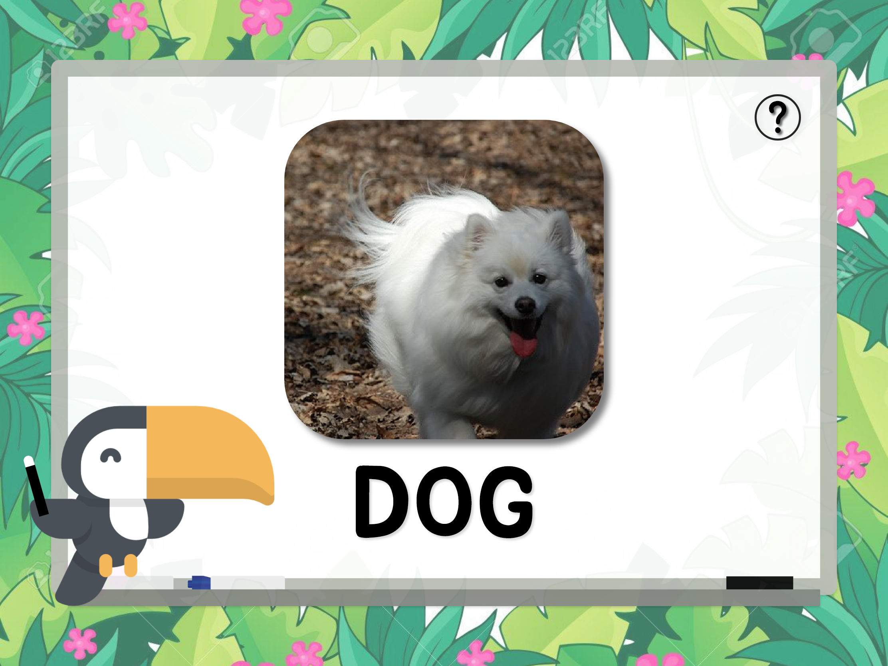
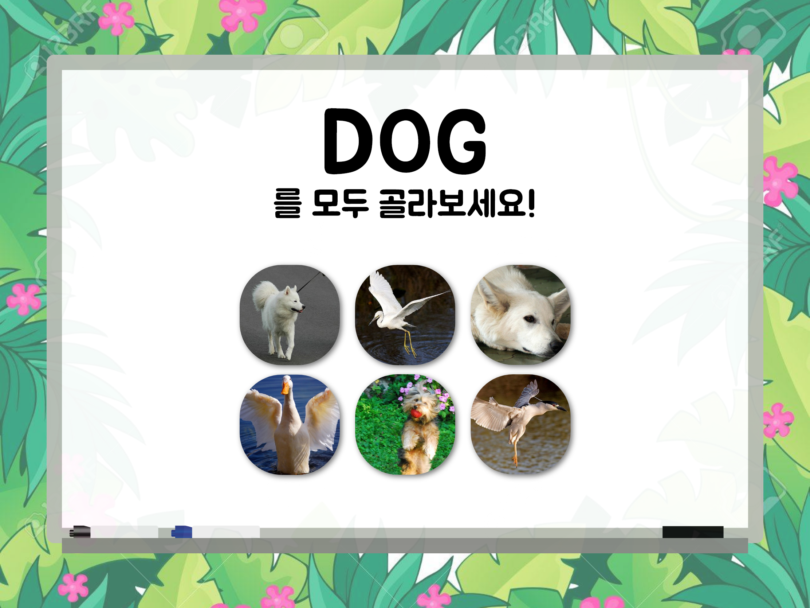
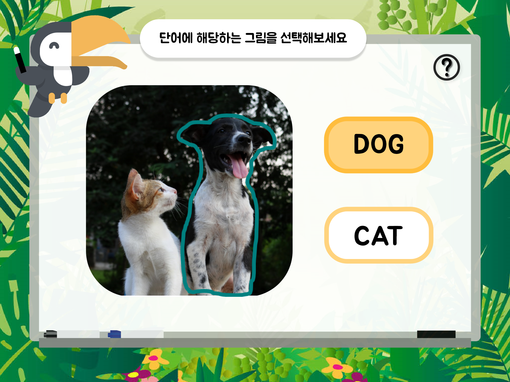
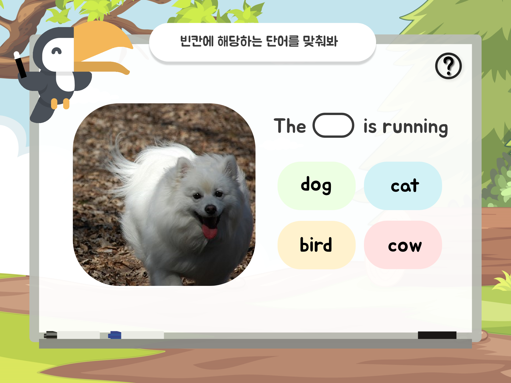
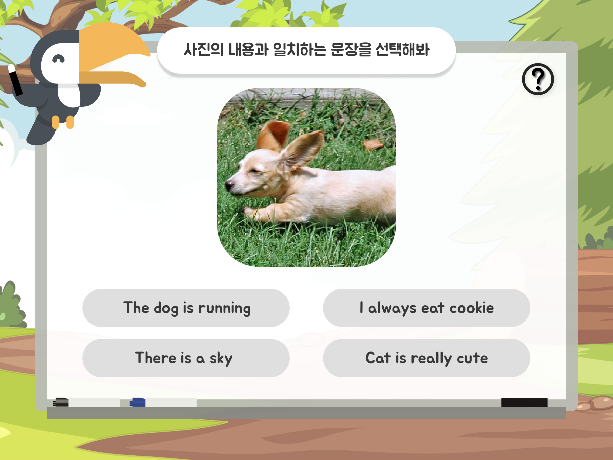
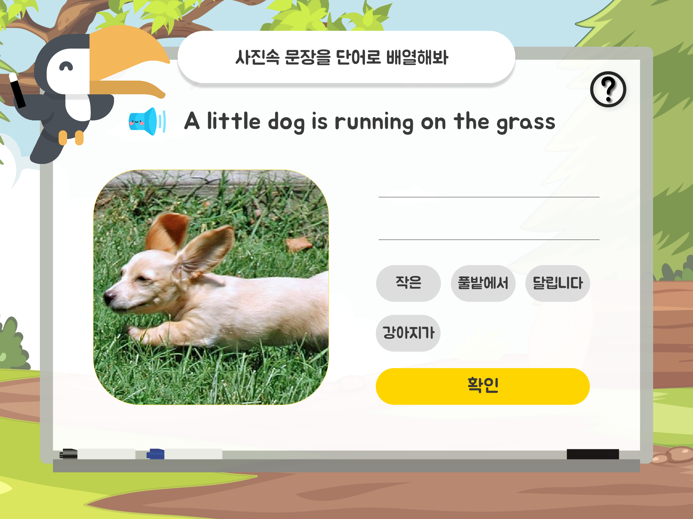
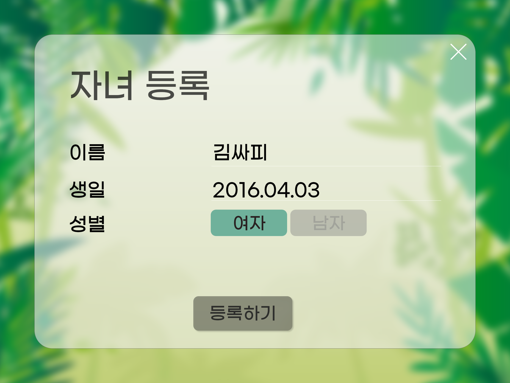

# :girl: 잉키 : English for kids :boy:

> 사진으로 즐겁게, 감정 인식으로 똑똑하게 :pencil2:
>
> 기분 변화에 따라 학습 시간을 조절해주는 영어 선생님 티키 :bird:

Made by. Team 디키 (Developers for kids)

## 목차

- [소개](#소개)
- [기획 의도](#기획 의도)
- [기능](#기능)
- [유사 서비스](#유사-서비스) 
- [향후 전망](#향후-전망)
- [기술 스택](#기술-스택)
- [기술 설명](#기술-설명)
	- [ERD](#erd)
	- [디렉토리 구조도](#디렉토리-구조도)
	- [기타](#기타)
- [테스트 방법](#테스트-방법)

## 소개

### Kids-Friendly

- 아이의 흥미를 높일 수 있는 귀여운 UI
- 지속적인 참여를 유도하는 Gamification
- AI가 표정을 판단해 자동으로 학습 시간 조절

### Parents-Friendly

- 아이의 학습 상황을 알려주는 email report
- 부모님의 참여로 만들어지는, 우리 아이만을 위한 학습 자료
- 우리 아이의 감정까지 케어해주는, 든든한 AI 선생님 티키 :bird:

## 기획 의도

- 학습을 할 때 이미지로 학습하면, 시각적인 자극을 주면 효율적이다.
- 아이들을 교육할 때 주변에 있는 사물, 인물, 동물부터 가르치는 게 효과적이나, 그런 학습 자료를 만들기 쉽지 않다.
- 기존 어플리케이션을 통한 학습은 아이들의 감정이나 집중력을 고려하지 못하므로 학습 효율이 떨어진다.

## 기능

### 단어 공부

    

- 사진을 보고 사물의 이름을 알 수 있다.

### 문장 공부

  

- 사진에 나온 사물들의 관계를 영어로 설명할 수 있다.

### 감정 인식

- 표정으로 감정을 추출한다.
- 학습자의 감정에 따라 학습 시간을 유동적으로 조절한다.

### 부모님 페이지

 

- 아이의 계정을 추가 / 삭제 / 관리할 수 있다.
- 아이의 학습 진행 상황을 볼 수 있다.
- 아이의 감정 그래프를 볼 수 있다.

### [와이어프레임 더 자세히 보기](https://xd.adobe.com/view/42773ad3-b714-4d3e-adca-458036d3732e-1724/)

## 유사 서비스

### [듀오링고](https://ko.duolingo.com/)

>  다양한 언어를 배울 수 있는 서비스. 한국어 사용자는 영어 학습만 가능. 단계별로 학습을 할 수 있다.

1. 익숙한 사물의 사진으로 학습

   -> 어린이의 흥미를 유발할 수 있다.

   -> 학습 효과를 높인다.

2. 학습 중인 어린이의 표정에서 감정을 추출

   -> 학습 시간을 유동적으로 조절한다.

   -> 아이의 감정 그래프를 제공해 부모의 유동적인 스케줄 관리가 가능하다.

## 향후 전망

> 부득이한 사정으로 프로젝트에 구현하지는 못했지만 보완할 점이나 추가할 점이 있다면 적어주세요

## 기술 스택

### Frontend

   
<br>
 

### Backend


### AI


### ETC

`Docker`, `AWS EC2`, `JIRA`, `Notion`

## 기술 설명

### ERD

> DB 및 백엔드를 구현할 때 ERD를 그려보고 리드미에 남겨주세요

### 디렉토리 구조도

### 기타

```
├─ ai-reference : 명세서 프로젝트 폴더
└─ docs
   ├─ images : 리드미에 사용된 이미지 폴더
   ├─ icons
   ├─ .gitmessage : commit template
   └─ initial_set.sh : git template 설정하는 shell script
```


## 테스트 방법
[방문하기](http://j3a510.p.ssafy.io/) (아직 배포 x…)

ID:

PW: